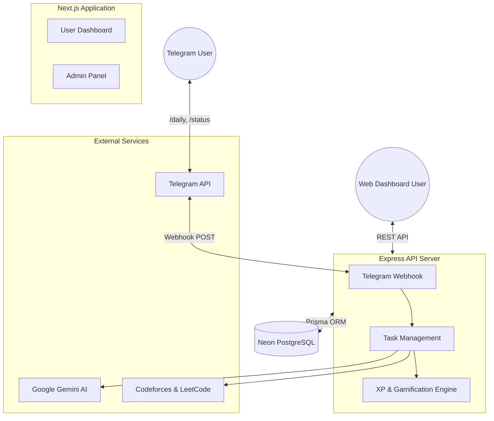

# ⚡ HelpMan — Gamified AI Placement Preparation Platform

**Daily AI-curated coding problems delivered via Telegram. Level up with XP, streaks, and leaderboards.**

---

## 🎯 Overview

**HelpMan** is an AI-powered placement preparation platform that automatically generates personalized daily coding tasks based on your Codeforces and LeetCode profiles. Tasks are delivered via Telegram and tracked with a gamification system including XP, streaks, ranks, and leaderboards.

### The Problem
- Students preparing for placements lack structured daily practice
- Existing platforms don't personalize problem selection to skill level
- No motivation system to maintain consistency during stressful seasons

### The Solution
- **AI Engine**: Gemini AI analyzes your ratings, weak topics, and history to generate 3 targeted problems daily
- **Telegram Delivery**: Receive tasks right where you chat using our Telegram Bot
- **Gamification**: XP with log-capped streak multipliers, rank progression (Bronze → Master), and competitive leaderboards

---

## ✨ Features

| Feature | Description |
|---------|-------------|
| 🤖 **AI Task Engine** | Gemini AI generates personalized daily problems from CF/LC |
| 📱 **Telegram Bot** | Quick daily delivery of tasks using `/daily` via Telegram |
| 🔥 **Streak System** | Log-capped multipliers reward consistency fairly |
| 🏆 **Rank Progression** | Progress from Bronze → Silver → Gold → Platinum → Master |
| 📊 **Dashboard** | Premium dark-mode UI with XP progress, stats, and tasks |
| 👥 **Leaderboard** | Top-3 podium + full ranking table |
| ⚙️ **Settings** | Profile, linked accounts, and difficulty preferences |
| 🛡️ **Admin Panel** | System stats, user management, and rank distribution |
| 🔒 **Security** | JWT auth, webhook signature verification, and rate limiting |
| 🗃️ **Audit Trail** | Every XP transaction is logged securely |

---

## 🏗 Architecture

HelpMan is built on a modern, decoupled architecture designed for scale and responsiveness. It utilizes a **Next.js frontend** for a dynamic user dashboard, and an **Express.js backend** acting as the central nervous system for API integrations, AI task generation, and the Telegram bot.

### System Flow

### How the Magic Works (The `/daily` Command)
1. **Trigger**: You send `/daily` to the Telegram Bot.
2. **Data Gathering**: The Express backend instantly fetches your live Codeforces and LeetCode ratings.
3. **AI Generation**: A structured prompt containing your ratings and weak topics is sent to **Google Gemini AI**.
4. **Processing**: Gemini returns 3 perfectly tailored coding problems. The backend validates this and securely stores it in **PostgreSQL**.
5. **Delivery**: The server formats the tasks into a rich message and delivers it back to you on Telegram.

---

**Built with ❤️ by Divyanshu**

⚡ *Start your placement prep journey today!* ⚡

